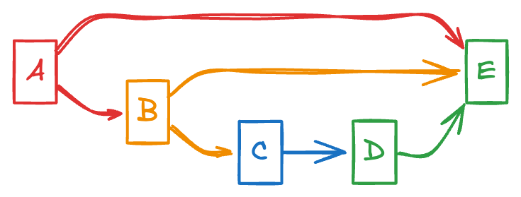

### Breadth First Search

It is same as level order traversal in trees where the edges are printed in level by level from sources node.
by level, we mean how many edges away are those nodes from the source node.

<h3><a href="https://www.geeksforgeeks.org/batch/dsa-python-self-paced/track/DS-Python-Graph/problem/bfs-traversal-of-graph" target="_blank">GFG</a></h3>

#### Approach to solve BFS:

It is based on queue data structure; first in, first out.
For deciding the source node where you are going to measure the other nodes from, either it will be given in problem statement or you can choose it.

1. Keep an array of size V, to track the nodes we have visited and to make sure we do not visit a node twice.
2. Create a queue
3. Add a vertex to the queue.
4. Remove that vertex from the queue.
5. Add the removed vertex to our answer list or print it.
6. Check for the neighbors of removed vertex, by neighbors we mean the element inside that specific vertex which was removed.
   1. If its neighbors are inside the visited list(added to the queue), do not add them to the queue.
   2. If its neighbors are not in the visited list(added to the queue):
      1. Add them to the queue.
      2. Make that specific index boolean value inside our visited list True.


The breadth first traversal for the above graph would be [A,B,E,C,D]

## Implementation:

```text
adj_list = [
    [1, 4],     # Adjacency list for vertex 0
    [0, 4, 2, 3], # Adjacency list for vertex 1
    [1, 3],     # Adjacency list for vertex 2
    [1, 2, 4],  # Adjacency list for vertex 3
    [0, 1, 3]   # Adjacency list for vertex 4
]

```

```text
BFS Traversal:
Start at vertex 0:

   Queue: [0]
   Visited: [True, False, False, False, False]
   Result: []
   Dequeue vertex 0, enqueue its neighbors 1 and 4:

   Queue: [1, 4]
   Visited: [True, True, False, False, True]
   Result: [0]
   Dequeue vertex 1, enqueue its unvisited neighbors 2 and 3:

   Queue: [4, 2, 3]
   Visited: [True, True, True, True, True]
   Result: [0, 1]
   Dequeue vertex 4, its neighbors 0, 1, and 3 are already visited:

   Queue: [2, 3]
   Visited: [True, True, True, True, True]
   Result: [0, 1, 4]
   Dequeue vertex 2, its neighbor 1 is already visited:

   Queue: [3]
   Visited: [True, True, True, True, True]
   Result: [0, 1, 4, 2]
   Dequeue vertex 3, its neighbors 1, 2, and 4 are already visited:

   Queue: []
   Visited: [True, True, True, True, True]

Result: [0, 1, 4, 2, 3]
```

## Analysis:

`Time Complexity`:

Vertices (V): Each vertex is enqueued and dequeued exactly once.
Edges (E): Each edge is checked once to find the neighbors (for undirected graphs, each edge is considered twice, once for each vertex).

Thus, the time complexity is O(V+E).

`Space Complexity`:
Queue: At most, the queue holds all vertices, O(V).
Visited list: A list of size O(V).
Thus, the space complexity is O(V).

| **Aspect**           | **Description**                                                                                                                                          |
| -------------------- | -------------------------------------------------------------------------------------------------------------------------------------------------------- |
| **Time Complexity**  | \(O(V + E)\), where \(V\) is the number of vertices and \(E\) is the number of edges. BFS checks each vertex and edge exactly once.                      |
| **Space Complexity** | \(O(V)\), for the queue and the visited list. The space used depends on the number of vertices in the graph.                                             |
| **Edge Checking**    | Each edge is checked when exploring the neighbors of a vertex. This happens during the `for` loop in the BFS algorithm for each vertex's adjacency list. |

In the BFS algorithm, we don’t count the space for the adjacency list because it is considered part of the graph representation rather than part of the BFS algorithm’s
It focus on the auxiliary data structures it uses.

## Space Complexity of BFS Algorithm in Depth

| **Aspect**                     | **Space Complexity** | **Explanation**                                                             |
| ------------------------------ | -------------------- | --------------------------------------------------------------------------- |
| **Visited List**               | \(O(V)\)             | Stores visitation status for each vertex.                                   |
| **Queue**                      | \(O(V)\)             | Holds vertices for the BFS traversal, worst case all vertices in the queue. |
| **Adjacency List**             | \(O(V + E)\)         | Part of the graph representation, not included in BFS space complexity.     |
| **Total BFS Space Complexity** | \(O(V)\)             | Space used by BFS algorithm excluding the graph representation.             |
