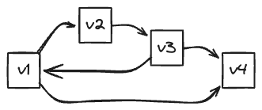

## Graph Representation Using Different Data Structures

A graph data structure is represented by a pair of sets.
First on represents the vertices and the second one represent the edges

Graph = (Vertex, Edge)
Vertices = {Vertex1, Vertex2, Vertex3,...,VertexN}
Edges = {(v1, v2),(v2, v3), (v3, v4),(v3,v1), (v1, v4)}.

There are different ways to represent a graph.

- Edge list
- Adjacency list
- Adjacency matrix
