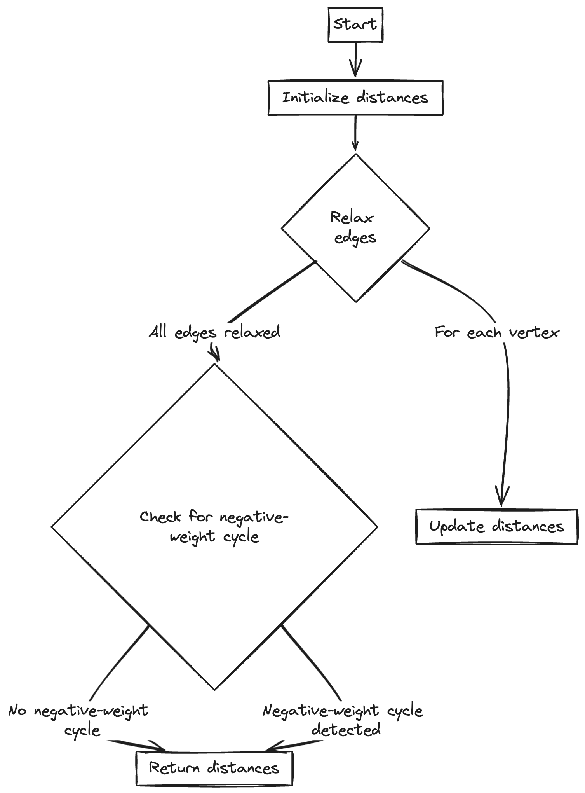

## Bellman Ford Algorithm

The Bellman-Ford algorithm is used for finding the shortest paths from a single source vertex to all other vertices in a weighted graph. It can handle graphs with negative weight edges, unlike Dijkstra's algorithm.

<h3><a href="https://www.geeksforgeeks.org/problems/distance-from-the-source-bellman-ford-algorithm/1?utm_source=geeksforgeeks">GFG-Bellman-ford</a></h3>
<h3><a href="https://www.geeksforgeeks.org/problems/negative-weight-cycle3504/1?utm_source=geeksforgeeks">Negative Weight Cycle/a></h3>

## Approach



1. ### Initialization:

- Initialize the distance to the source vertex S as 0.
- Initialize the distance to all other vertices as a large number (in this case, 100000000).

2. ### Relaxation:

- Iterate V-1 times (where V is the number of vertices) over all the edges in the graph.
- Update the distance to each vertex if a shorter path is found.

3. ### Negative Weight Cycle Detection:

- After V-1 iterations, if you can still relax any edge, it means there is a negative weight cycle in the graph.

```py
for u, v, wt in edges:
    if ans[u] != 100000000 and ans[u] + wt < ans[v]:
        return [-1]

```

This loop iterates over all the edges one more time after completing the V-1 relaxation steps.
If you can find any edge (u, v) that can still be relaxed (i.e., ans[u] + wt < ans[v]), it means there is a cycle in the graph that can reduce the path cost infinitely.
If such an edge is found, the function returns [-1] indicating the presence of a negative weight cycle.
If no such edge is found, the algorithm returns the shortest path distances.

This loop is crucial because the presence of a negative weight cycle can make it impossible to find a meaningful shortest path, as you could keep traversing the cycle to reduce the path cost indefinitely. By detecting this, the Bellman-Ford algorithm ensures that the results are valid and meaningful.

## Analysis:

`Time Complexity`: `O(V*E)`.
`Space Complexity`: `O(V)`.
