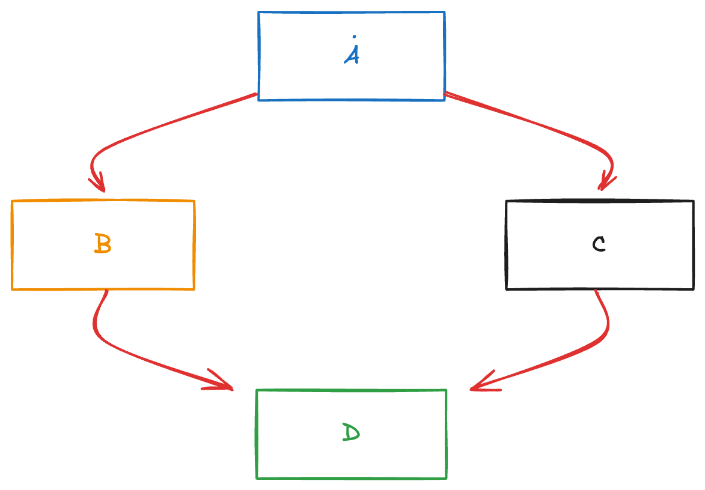

## Topological sorting

Given an adjacency list for a Directed Acyclic Graph (DAG) where adj_list[i] contains a list of all vertices j such that there is a directed edge from vertex i to vertex j, with V vertices and E edges, your task is to find any valid topological sorting of the graph.

###### In a topological sort, for every directed edge u -> v, u must come before v in the ordering.

linear ordering of a graph such that for every directed edge (u,v), vertex u comes before v in the ordering.
it is only possible for direct and acyclic graph, because we want to preserve the ordering, if it is not directed or it has circle, then there is no ordering.

Each vertex is known as a job and each job should be done before its dependencies.

### Kahn's Algorithm

1. Create an inDegree array:
   1. create an empty array of size V.
   2. count the number of in-degree for each node and add the count of it to the newly created array.
2. Create a queue
3. Add the elements with zero in-degree to the queue and remove it.
4. Remove a vertex from the deque , add it to the result list.
5. For each adjacent vertex of the removed vertex, decrement its indegree.
   1. if in-degree becomes zero, add to the queue.
6. Repeat step 3-4 until the queue becomes empty.
