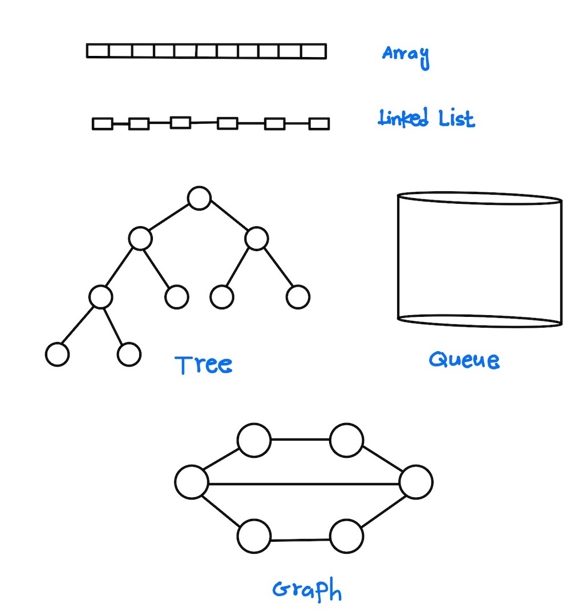

# Data Structures and Algorithms

## Data Structure:

The way to organize data in main memory.

## Algorithm:

The sequence of steps to solve a problem.

Welcome to my repository for Data Structures and Algorithms solutions! Here, I share my solutions and implementations for various DSA problems, organized by topics.

## Table of Contents

- [Data Structures and Algorithms Solutions](#data-structures-and-algorithms-solutions) - [Data Structure:](#data-structure) - [Algorithm:](#algorithm)
  - [Introduction](#introduction)
  - [Table of Contents](#table-of-contents)
  - [Contributing](#contributing)

## Introduction

This repository is a collection of my solutions to common Data Structures and Algorithms (DSA) problems. Whether you're preparing for coding interviews or just want to strengthen your understanding of DSA concepts, you'll find a variety of topics covered here.

Each folder corresponds to a specific DSA topic, containing solutions in python programming language. Feel free to explore and use these solutions for learning and reference purposes.
Within each folder, you'll find solutions to general DSA problems as well as solutions to <a href="https://leetcode.com/problemset/?difficulty=EASY&page=1&topicSlugs=array">LeetCode</a> problems related to that topic.

## Table of Contents:

| Folder Name             | Description                                     | Link                                                          |
| ----------------------- | ----------------------------------------------- | ------------------------------------------------------------- |
| .vscode                 | VS Code settings and configurations             | <a href=./.vscode/> .vscode </a>                              |
| 02-mathematics          | Mathematics related solutions                   | <a href=./02-mathematics/> mathematics </a>                   |
| 03-list                 | List related solutions                          | <a href=./03-list/> list </a>                                 |
| 04-tuples               | Tuples related solutions                        | <a href=./04-tuples/> tuples </a>                             |
| 05-sets                 | Sets related solutions                          | <a href=./05-sets/> sets </a>                                 |
| 06-functions            | Functions related solutions                     | <a href=./06-functions/> functions </a>                       |
| 06-loops                | Loops related solutions                         | <a href=./06-loops/> loops </a>                               |
| 08-patterns             | Patterns related solutions                      | <a href=./08-patterns/> patterns </a>                         |
| 09-arrays               | Arrays related solutions                        | <a href=./09-arrays/> arrays </a>                             |
| 10-bits                 | Bit manipulation related solutions              | <a href=./10-bits/> bits </a>                                 |
| 11-dictionary           | Dictionary related solutions                    | <a href=./11-dictionary/> dictionary </a>                     |
| 12-hashmap              | Hashmap related solutions                       | <a href=./12-hashmap/> hashmap </a>                           |
| 14-searching            | Searching algorithms solutions                  | <a href=./14-searching/> searching </a>                       |
| 15-sorting              | Sorting algorithms solutions                    | <a href=./15-sorting/> sorting </a>                           |
| 16-recursion            | Recursion related solutions                     | <a href=./16-recursion/> recursion </a>                       |
| 16-stack/minStack       | Stack related solutions                         | <a href=./16-stack/minStack/> stack/minStack </a>             |
| 17-string               | String manipulation solutions                   | <a href=./17-string/> string </a>                             |
| 18-linked-list          | Linked List data structure solutions            | <a href=./18-linked-list/> linked-list </a>                   |
| 18-trees                | Tree data structure solutions                   | <a href=./18-trees/> trees </a>                               |
| 19-binary-search-tree   | Binary Search Tree data structure solutions     | <a href=./19-binary-search-tree/> binary-search-tree </a>     |
| 19-stack                | Stack data structure solutions                  | <a href=./19-stack/> stack </a>                               |
| 21-queue                | Queue data structure solutions                  | <a href=./21-queue/> queue </a>                               |
| 22-graphs               | Graph data structure solutions                  | <a href=./22-graphs/> graphs </a>                             |
| 24-heap                 | Heap data structure solutions                   | <a href=./24-heap/> heap </a>                                 |
| 26-dynamic-programming  | Dynamic Programming solutions                   | <a href=./26-dynamic-programming/> dynamic-programming </a>   |
| 27-graphs               | More Graph data structure solutions             | <a href=./27-graphs/> graphs </a>                             |
| 28-two-pointers         | Two Pointers technique solutions                | <a href=./28-two-pointers/> two-pointers </a>                 |
| 29-advanced-mathematics | Advanced Mathematics solutions                  | <a href=./29-advanced-mathematics/> advanced-mathematics </a> |
| assets                  | Various assets like images, etc.                | <a href=./assets/> assets </a>                                |
| leetcode                | Solutions related to LeetCode problems          | <a href=./leetcode/> leetcode </a>                            |
| python-helper           | Helper files and utilities for Python solutions | <a href=./python-helper/> python-helper </a>                  |

## List of Topics

Here's a more detailed list of the DSA topics covered in this repository:

- Tuples
- Lists
- Loops and Conditional Statements
- Patterns
- Functions
- Arrays
- Bit Manipulation
- Strings
- Dictionaries (Hash Maps)
- Sets
- Mathematics Algorithms
- Recursion
- Sorting Algorithms
- Binary Search
- Linked Lists
- Stacks
- Queues
- Trees
- Binary Search Trees
- Heaps
- Dynamic Programming
- Graphs
- Algorithms
- LeetCode Problems

## Contributing

If you'd like to contribute to this repository by adding your own solutions or improving existing ones, feel free to fork the repository and submit a pull request! Your contributions are greatly appreciated.
